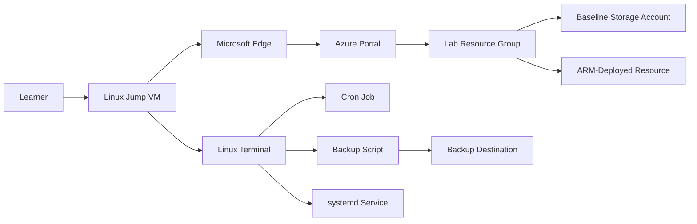

# Getting Started

## Scenario

You are a cloud automation engineer working in a shared Azure lab environment. In this 90-minute assessment lab, you will complete four challenge exercises focused on Azure resource deployment, static website hosting, Linux automation, and service configuration. The exercises are designed to assess your ability to work independently in Azure and Linux without detailed procedural guidance.

## Lab Overview

This challenge lab includes four mostly independent exercises that share the same Azure subscription and jump VM environment:

- Deploy an Azure resource by using an ARM template.
- Configure static website hosting in Azure Storage.
- Create and schedule a Linux backup task with cron.
- Configure a persistent systemd service for the backup script.

Azure tasks are completed from the Linux jump VM by opening **Microsoft Edge**, browsing to <https://portal.azure.com>, and signing in with:

- Username: `<inject key="azureaduseremail" enableCopy="false" />`
- Password: `<inject key="azureaduserpassword" enableCopy="false" />`

Linux tasks are completed directly on the jump VM.

Your deployment identifier for this lab is <inject key="deploymentid" enableCopy="false" />

## Expectations

This is an assessment-style lab, not a tutorial. You are expected to determine the required Azure and Linux actions based on each exercise objective and success criteria.

Keep the following expectations in mind:

- Use the Linux jump VM as your primary workstation.
- Complete **Azure tasks** through the Azure portal in Microsoft Edge on the jump VM.
- Complete **Linux tasks** directly in the terminal on the jump VM.
- Reuse the shared lab environment across all exercises.
- Verify your work against the stated outcomes before moving on.

## Architecture

The lab environment provides a shared Azure resource group, a Linux jump VM, and a Storage Account that supports the static website exercise.

## Components

- **Linux jump VM**: Main workstation for all lab activities.
- **Microsoft Edge**: Browser used on the jump VM to access the Azure portal.
- **Azure resource group**: Shared scope for Azure resources used in the lab.
- **Baseline Storage Account**: Provided for the static website exercise.
- **Local Linux file paths**: Used for backup and service configuration exercises.

## After publishing

> [!Note] These steps run **after** you push the template to CloudLabs — they verify CloudLabs can actually serve this lab guide to candidates.

- **Verify docs-proxy access:** open Templates → your template → **Lab Guide Settings** in <https://admin.cloudlabs.ai> and confirm CloudLabs can reach this repo via the docs proxy. If the repo is private, configure GitHub access at the template level.
- **Verify inline questions and inline validations:** sign in to <https://admin.cloudlabs.ai>, open your template, and walk through one full lab run to confirm every `<question>` and `<validation step="..."/>` renders correctly. Fix any that don't resolve.
